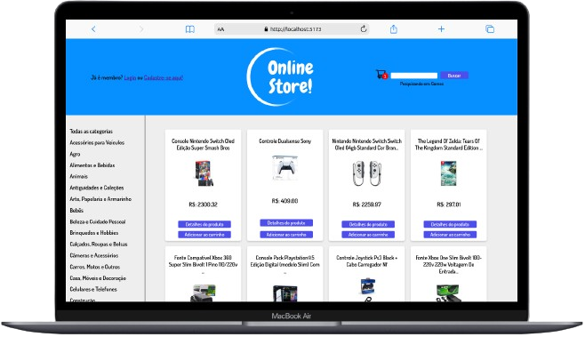
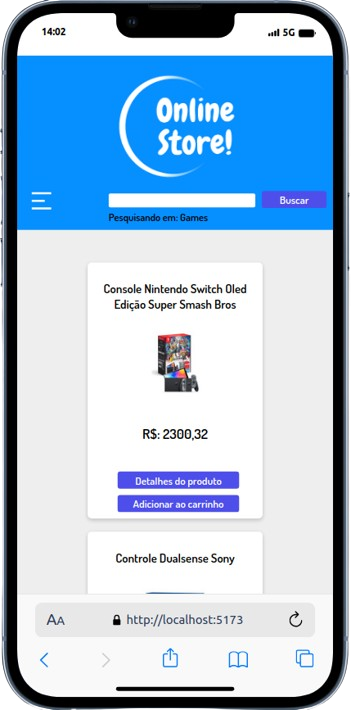

# Online Store

## Descrição

Online Store é uma aplicação Web Front-End que consome a API de produtos do Mercado Livre.

O objetivo da aplicação foi simular um site de e-commerce com utilização de carrinho de compras, validação de cartão e review de produtos.

A aplicação é responsiva  e possui uma cobertura acima de 90% nos testes.

**Confira a aplicação rodando aqui:** https://online-store-nine-omega.vercel.app/

## Features:

- Fazer cadastro e login.
- Pesquisa de produtos, podendo escolher, também, a categoria da pesquisa.
- Ver detalhes do produto.
- Adicionar o produto no carrinho.
- Aumentar, diminuir a quantidade de itens ou remover o produto do carrinho.
- Adicionar um review na página de detalhes do produto, também podendo adicionar uma nota de 1 a 5 estrelas.

## Instalação

Para instalar e utilizar o aplicativo, siga os seguintes passos:

    - É necessário ter o git instalado no computador.
    - Clique no botão verde chamado ‘Code’.
    - Caso tenha uma chave SSH no seu computador, pode escolher a opção SSH.
    - Copie o endereço. Ex.: ‘[git@github.com](mailto:git@github.com):GabrielMunizz/OnlineStore.git’
    - Escolha uma pasta para clonar o projeto.
    - Entre na pasta e abra o terminal.
    - Digite ‘git clone endereço’. Ex.: git clone [git@github.com](mailto:git@github.com):GabrielMunizz/OnlineStore.git
    - Depois de clonar, entre na pasta ‘OnlineStore’ que foi gerada.
    - Abra o terminal e digite ‘npm install’
    - Ao terminar de instalar as dependências, digite ‘npm run dev’ no terminal e o projeto deve rodar no seu navegador automaticamente. 

## Uso

A aplicação é bem simples de usar:

    - Para fazer cadastro, clique no botão “cadastre-se aqui’ no canto superior esquerdo da tela principal.
    - Para pesquisar, basta digitar na barra de procura o nome do produto e clicar em “Buscar”.
    - Caso tenha encontrado, para ver os detalhes do produto, clique em “Detalhes do produto”.
    - Se tiver interesse em adquirir o produto, clique em “Adicionar ao carrinho”.
    - Caso já possua uma conta cadastrada, também é possível adicionar uma review do produto clicando em “Avaliar” na página de detalhes do produto.
    - Para ver o seu carrinho, clique no ícone de carrinho de compras que se encontra no canto superior direito da tela.
    - Revise os produtos no seu carrinho: caso queira aumentar a quantidade, é só clicar no botão ‘ + ’ ou diminua clicando no botão ‘ - ’.
    - Caso queira retirar algum produto, clique no botão “Remover”.
    - Ao clicar no botão “Finalizar compra”, será redirecionado para uma tela com um formulário para informações de entrega e método de pagamento. Preenchendo o formulário, basta clicar em “Concluir” e será redirecionado para uma tela de conclusão de pedido.

## Tecnologias utilizadas

- Redux
- Context API
- Styled-Components
- TypeScript
- Sweet Alert
- Vitest
- Custom hooks

## Autor

    

        
    

    

        <h3>Gabriel Muniz Ferreira</h3>
        
Desenvolvedor Full- Stack | React.JS | TypeScript | Redux | Node.JS | MySQL | Metodologias Ágeis

        
<a href="https://www.linkedin.com/in/gabriel-muniz-dev/" target="_blank">Linkedin</a>

        
<a href="https://github.com/GabrielMunizz" target="_blank">GitHub</a>

        
Email: <a href="mailto:gabrielmfd@gmail.com">gabrielmfd@gmail.com</a>

    

## Licença

Esse aplicação possui licença MIT.